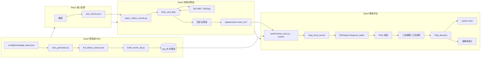
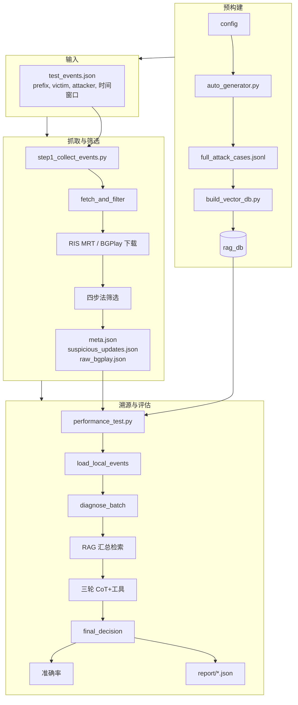

# BGP 异常溯源项目 — 流程图资料与画图说明

本文档按步骤整理**输入、输出、作用**及**对应代码**，便于画流程图；并以**一个具体事件**为例，说明每一步的输入与输出如何衔接。文末提供 Mermaid 示例与画图工具推荐。

---

## 一、以具体事件为例的端到端流程

以下以**单条告警事件**为例，说明从配置到报告的全流程，每一步都标明「本步输入」与「传给下一步的输出」。

**示例事件**：2014 年 Indosat 劫持 Google DNS 前缀 8.8.8.0/24  
- 前缀：`8.8.8.0/24`  
- 合法持有者（victim）：`15169`（Google）  
- 真值攻击者（attacker）：`4761`（Indosat）  
- 时间窗口：`2014-04-01T08:00:00` ~ `2014-04-01T18:00:00`

---

### Step 0：RAG 知识库构建（预构建，本例不重新跑）

| 项目 | 本例说明 |
|------|----------|
| **本步输入** | `config/knowledge_base.json` 中的 entities（victims/attackers/transit）；无“本事件”相关输入。 |
| **本步输出（给后续用）** | ① `data/full_attack_cases.jsonl`：多类劫持/泄露案例 ② `./rag_db/`：每条案例的 `scenario_desc` 向量化后存入 ChromaDB。 |
| **传给下一步** | Step1 不依赖 Step0 输出；Step3 的 Agent 会从 `rag_db` 做相似案例检索。 |

---

### Step 1：输入告警事件（人工配置）

| 项目 | 本例内容 |
|------|----------|
| **本步输入** | 无（人工根据历史事件填写）。 |
| **本步输出** | 写入 `data/test_events.json` 的一条记录，即**传给 Step2 的输入**。 |

**本步输出（传给 Step2）示例：**

```json
{
  "prefix": "8.8.8.0/24",
  "victim": "15169",
  "attacker": "4761",
  "start_time": "2014-04-01T08:00:00",
  "end_time": "2014-04-01T18:00:00",
  "source": "anomaly"
}
```

---

### Step 2：抓取源数据并筛选可疑 updates

| 项目 | 本例内容 |
|------|----------|
| **本步输入** | 上一步输出的**该条事件**：prefix=8.8.8.0/24, victim=15169, start_time/end_time 如上；以及命令行 `--source ris_mrt`（或 ripestat/auto）。 |
| **本步做什么** | 用 prefix + 时间窗口向 RIPE RIS MRT（或 BGPlay）请求原始 BGP updates；用四步法（前缀、Origin、时间、Valley-Free）筛选；若无真实数据则可能走 fallback 生成一条合成 update。 |
| **本步输出** | 为该事件生成目录 `data/events/8.8.8.0_24_4761_2014-04-01T08_00_00/`，其下文件即**传给 Step3 的输入**。 |

**本步输出（传给 Step3）示例：**

**① `meta.json`**

```json
{
  "event_id": "8.8.8.0_24_4761_2014-04-01T08_00_00",
  "prefix": "8.8.8.0/24",
  "victim": "15169",
  "attacker": "4761",
  "start_time": "2014-04-01T08:00:00",
  "end_time": "2014-04-01T18:00:00",
  "source": "anomaly",
  "data_source": "fallback",
  "suspicious_count": 1
}
```

**② `suspicious_updates.json`**

```json
[
  {
    "prefix": "8.8.8.0/24",
    "as_path": "3356 4761",
    "detected_origin": "4761",
    "expected_origin": "15169",
    "timestamp": "2014-04-01T08:00:00",
    "reason": "FALLBACK"
  }
]
```

**③ `raw_bgplay.json`**（若有真实抓取则存在，否则可能无或为空结构）

---

### Step 3：溯源评估（Agent 批量溯源 + 准确率）

| 项目 | 本例内容 |
|------|----------|
| **本步输入** | 由 Step2 输出的**该事件目录**：读取 `meta.json` + `suspicious_updates.json`，组装成一条“案例”；同时依赖 Step0 的 `rag_db` 做 RAG 检索。 |

**本步从 Step2 读入并组装后的 context（传给 Agent 的输入）示例：**

```json
{
  "time_window": {
    "start": "2014-04-01T08:00:00",
    "end": "2014-04-01T18:00:00"
  },
  "updates": [
    {
      "prefix": "8.8.8.0/24",
      "as_path": "3356 4761",
      "detected_origin": "4761",
      "expected_origin": "15169"
    }
  ]
}
```

**真值（用于比对）**：`expected_attacker = "4761"`（来自 meta.json 的 `attacker`）。

| 项目 | 本例内容 |
|------|----------|
| **本步做什么** | 对上述 context 调用 `BGPAgent.diagnose_batch(context)`：RAG 汇总检索 → 三轮推理（每轮可调用 path_forensics 等工具）→ 得到 `final_decision`；再与真值 4761 比较，算命中与否及准确率。 |
| **本步输出** | ① **给“下一步/用户”的报告**：`report/forensics/forensics_batch_8.8.8.0_24_1updates_<时间戳>.json` ② **控制台**：该案例的判定结果（most_likely_attacker、命中/未命中）、以及汇总准确率。 |

**本步输出（报告）中与结论直接相关的片段示例：**

```json
{
  "target": {
    "time_window": { "start": "2014-04-01T08:00:00", "end": "2014-04-01T18:00:00" },
    "updates": [{ "prefix": "8.8.8.0/24", "as_path": "3356 4761", "detected_origin": "4761", "expected_origin": "15169" }]
  },
  "rag_context": "--- [参考案例 #1 | 相关性: 0.57] ---\n【类型】: Direct Hijack\n【场景】: A BGP announcement for Google's prefix 8.8.8.0/24 ...",
  "chain_of_thought": [
    { "round": 1, "thought": "...", "tool_used": "path_forensics", "tool_output": "..." },
    { "round": 2, "thought": "...", "tool_used": null, "tool_output": null }
  ],
  "final_result": {
    "status": "MALICIOUS",
    "most_likely_attacker": "4761",
    "confidence": "High",
    "summary": "综合 1 条告警，Origin 4761 ≠ 预期 15169，判定为直接劫持，攻击者 AS4761。"
  }
}
```

**准确率逻辑**：若 `most_likely_attacker` 与真值 `"4761"` 一致则计为命中，否则未命中；多事件时命中数/总事件数 = 准确率。

---

### 小结：本例数据在步骤间的传递

| 步骤 | 本步输入（来自上一步或人工） | 本步输出（传给下一步或最终用户） |
|------|------------------------------|----------------------------------|
| Step0 | config + 无事件文件 | rag_db/、full_attack_cases.jsonl（供 Step3 RAG 与案例库用） |
| Step1 | 无 | test_events.json 中一条：prefix/victim/attacker/时间窗口 |
| Step2 | test_events.json 该条 + --source | data/events/8.8.8.0_24_4761_2014-04-01T08_00_00/ 下 meta.json、suspicious_updates.json、raw_bgplay.json |
| Step3 | 该目录下 meta + suspicious_updates（+ rag_db） | report/forensics/forensics_batch_*.json（含 target、rag_context、chain_of_thought、final_result）+ 控制台准确率 |

---

## 二、流程总览（主链路）

```
[Step0 预构建] → [Step1 输入告警] → [Step2 抓取并筛选] → [Step3 溯源评估] → [输出报告]
     RAG 库         test_events.json    data/events/      performance_test    report/*.json
```

---

## 三、各步骤明细（输入 / 输出 / 作用 / 代码）

### Step 0：RAG 知识库构建（预构建，非每次运行）

| 项目 | 内容 |
|------|------|
| **作用** | 生成溯源案例并建向量库，供 Agent 检索相似历史案例 |
| **输入** | 无文件输入（LLM 按配置生成）；配置来自 `config/knowledge_base.json` 的 entities |
| **输出** | ① `data/full_attack_cases.jsonl`（案例列表） ② `./rag_db/`（ChromaDB 向量库） |
| **脚本** | `python auto_generator/auto_generator.py` → `python build_vector_db.py` |
| **关键函数** | `AttackDataGenerator.generate_case()`；`RAGManager.load_knowledge_base()` |

**子步 0a — 生成案例**

| 项目 | 内容 |
|------|------|
| 输入 | 配置（victims/attackers/transit 等） |
| 输出 | `data/full_attack_cases.jsonl`，每行一条 JSON：`type, scenario_desc, analysis_logic, conclusion` 等 |
| 作用 | 用 LLM 生成 Direct Hijack / Path Forgery / Route Leak 三类溯源案例 |

**子步 0b — 构建向量库**

| 项目 | 内容 |
|------|------|
| 输入 | `data/full_attack_cases.jsonl` |
| 输出 | `./rag_db/`（ChromaDB，每条案例的 `scenario_desc` 编码为向量） |
| 作用 | 将案例向量化并持久化，供后续 RAG 检索 |

---

### Step 1：输入告警事件（人工配置）

| 项目 | 内容 |
|------|------|
| **作用** | 定义待溯源的 BGP 异常事件：前缀、受害者、攻击者真值、时间窗口 |
| **输入** | 无（人工编辑文件） |
| **输出** | `data/test_events.json` |
| **脚本** | 无，直接编辑 JSON |
| **文件格式** | `[{ "prefix", "victim", "attacker", "start_time", "end_time", "source?" }]` |

**输出示例（单条）：**

```json
{
  "prefix": "8.8.8.0/24",
  "victim": "15169",
  "attacker": "4761",
  "start_time": "2014-04-01T08:00:00",
  "end_time": "2014-04-01T18:00:00",
  "source": "anomaly"
}
```

---

### Step 2：抓取源数据并筛选可疑 updates

| 项目 | 内容 |
|------|------|
| **作用** | 按事件时间窗口下载原始 BGP updates，用四步法筛出可疑 updates，按事件落盘 |
| **输入** | `data/test_events.json`（及 `--input` 指定路径）；`--source ris_mrt|ripestat|auto` |
| **输出** | `data/events/<event_id>/` 下每个事件一个目录 |
| **脚本** | `python scripts/step1_collect_events.py [--input data/test_events.json] [--output data/events] [--source ris_mrt]` |
| **关键函数** | `load_local_events()`；`fetch_and_filter()`（内部调 RIS MRT 或 BGPlay + 四步法） |

**每个事件目录输出：**

| 文件 | 内容 |
|------|------|
| `meta.json` | event_id, prefix, victim, attacker, start_time, end_time, data_source, suspicious_count |
| `suspicious_updates.json` | 列表：`[{ prefix, as_path, detected_origin, expected_origin, timestamp, reason }]` |
| `raw_bgplay.json` | 原始 BGPlay/RIS 数据（备用） |

**四步法（在 `update_fetcher` / `ris_mrt_fetcher` 中）：**  
前缀过滤 → Origin 校验（≠expected）→ 时间窗口 → Valley-Free（Tier1→非T1→T1）

---

### Step 3：溯源评估（Agent 批量溯源 + 准确率）

| 项目 | 内容 |
|------|------|
| **作用** | 从 `data/events/` 读入事件，对每个事件用 Agent 做批量溯源，再与真值比对算准确率 |
| **输入** | `data/events/` 下各子目录的 `meta.json` + `suspicious_updates.json`（由 Step2 生成） |
| **输出** | ① 控制台：每个案例的判定结果、命中/未命中、准确率 ② `report/forensics/forensics_batch_*.json`（每事件一份溯源报告） |
| **脚本** | `python performance_test.py --events [--events-dir data/events]` |
| **关键函数** | `load_local_events()`；`run_benchmark()`；`BGPAgent.diagnose_batch()` |

**Agent 内部流程（便于画子图）：**

| 阶段 | 输入 | 输出 | 作用 |
|------|------|------|------|
| Phase 1 RAG | `updates`（批量时整表） | 历史案例文本 | `search_similar_cases_batch(updates)` 汇总检索 |
| Phase 2 构造 Prompt | System Prompt + RAG 文本 + 当前 updates | messages | 组装给 LLM 的上下文 |
| Phase 3 三轮推理 | messages | 每轮：thought_process, tool_request, tool_output | LLM 思考 → 调用 path_forensics 等 → 根据结果再思考 |
| Phase 4 结案 | 最后一轮或强制 | final_decision（most_likely_attacker, confidence） | 输出攻击者 AS 与置信度 |

**报告 JSON 结构（每条事件）：**

- `target`：time_window + updates  
- `rag_context`：检索到的历史案例文本  
- `chain_of_thought`：每轮 thought、ai_full_response、tool_used、tool_output  
- `final_result`：status, most_likely_attacker, confidence, summary  

---

### Step3 中使用的各工具（输入 / 输出）

Step3 中 Agent 每轮可请求调用以下工具，由 `tools/bgp_toolkit.py` 的 `call_tool(tool_name, context, is_batch)` 统一分发。**输入**均为当前告警上下文 `context`（单条时为单条 update 字典，批量时为 `{ time_window, updates: [...] }`）；**输出**均为字符串，供 LLM 下一轮推理使用。

| 工具名 | 输入 | 输出 | 说明 |
|--------|------|------|------|
| **path_forensics** | **单条**：`context` 含 `as_path`, `expected_origin`。<br/>**批量**：`context.updates` 列表，每条含 `prefix`, `as_path`, `detected_origin`, `expected_origin`。 | **单条**：一段报告文本，包含 path 序列、Observed Origin、Expected Owner，以及「Origin 不匹配 → 嫌疑人为 Origin」或「Origin 匹配 → 建议检查上游 Leaker」的结论。<br/>**批量**：每条 update 一行分析 + 末尾汇总统计（各 AS 作为嫌疑人/Leaker 的频次），便于综合判断 most_likely_attacker。 | 解析 AS_PATH，提取 Origin，判定直接劫持嫌疑人或 Route Leak 上游嫌疑人。 |
| **graph_analysis** | **单条**：`context`（含 prefix、as_path 或 detected_origin、expected_origin）。<br/>**批量**：取 `context.updates[0]` 作为当前分析对象。 | 若已接 Neo4j：返回图谱分析结果（如 Origin 与 Owner 的拓扑关系/路径）。<br/>若未接 Neo4j：返回一段说明「Neo4j 未连接」及当前 Observed/Expected AS 的提示文本。 | 查询 Neo4j 中 Origin 与合法 Owner 的拓扑关系，验证路径真实性。 |
| **authority_check** | **单条**：`context` 含 `prefix`, `as_path`（用于提取 Origin）。<br/>**批量**：对 `context.updates` 中每条分别检查，每条需 `prefix`, `as_path` 或 `detected_origin`。 | **单条**：一行结论，如 `VALID: ...` / `INVALID: ...` / `UNKNOWN: ...`。<br/>**批量**：每条 update 一行 RPKI 结论，若有 INVALID 则末尾汇总非法 Origin AS 出现频次。 | RPKI 授权校验：prefix + Origin 是否在 ROA 中合法；优先 RIPEstat API，失败时用知识库兜底。 |
| **geo_check** | **单条**：`context` 含 `prefix`, `as_path`（用于提取 Origin）。<br/>**批量**：取 `context.updates[0]` 作为当前分析对象。 | 一段文本：`MATCH`（前缀注册地与 Origin 注册地一致）/ `CONFLICT`（不一致，地理围栏警报）/ `LOW_RISK`（同区域内不一致）/ `SKIPPED`（数据缺失）。 | 比较前缀注册地与 Origin AS 注册地，发现地理冲突；依赖 RIPEstat 地理位置数据。 |
| **neighbor_check** | **单条**：`context` 含 `as_path`（取首跳为传播源）。<br/>**批量**：取 `context.updates[0]` 的 `as_path`。 | 一段文本：传播源 AS 的 holder 信息；若该 AS 在知识库 `risk_asns` 中则标注 `Neighbor Risk: HIGH` 及原因，否则为 LOW。 | 分析路径首跳（上游邻居）信誉，结合知识库风险 AS 列表。 |
| **topology_check** | **单条**：`context` 含 `as_path`。<br/>**批量**：取 `context.updates[0]`。 | 一段文本：`NORMAL`（路径过短或未发现违规）/ `ROUTE_LEAK: 疑似路由泄露！流量穿透了非骨干网 AS [xxx]`。 | Valley-Free 检测：路径中是否存在 Tier1→非Tier1→Tier1，若有则指出中间 AS 为疑似 Leaker。 |

**统一约定**：

- **输入**：Agent 调用工具时传入的 `context` 即当前「告警上下文」；批量模式下为 `{ time_window, updates }`，单条模式下为单条 `{ prefix, as_path, detected_origin, expected_origin }`。部分工具在批量时只取第一条 update 分析（如 graph_analysis、geo_check、neighbor_check、topology_check），path_forensics 与 authority_check 则对批量中每条分别处理并汇总。
- **输出**：均为**字符串**，直接拼进下一轮发给 LLM 的「工具结果」中，供其继续推理并决定是否再调用工具或输出 final_decision。

---

## 四、数据流简表（画图时可贴到节点旁）

| 步骤 | 输入 | 输出 |
|------|------|------|
| 0a 生成案例 | 配置 | full_attack_cases.jsonl |
| 0b 构建 RAG | full_attack_cases.jsonl | rag_db/ |
| 1 告警配置 | 无 | test_events.json |
| 2 抓取筛选 | test_events.json, --source | data/events/<id>/meta.json, suspicious_updates.json, raw_bgplay.json |
| 3 溯源评估 | data/events/ | report/forensics/forensics_batch_*.json，控制台准确率 |

---

## 五、Mermaid 流程图示例（可直接用或导入工具）

下面这段可在 [Mermaid Live](https://mermaid.live)、Draw.io、Typora、VS Code 插件等中渲染为图。



**纵向版（自上而下）：**



---

## 六、画图工具推荐

| 工具 | 类型 | 特点 | 适用场景 |
|------|------|------|----------|
| **Draw.io (diagrams.net)** | 在线/桌面 | 免费、无账号可用、支持 Mermaid 导入、导出 PNG/SVG/PDF | 答辩/报告用图、多页流程图 |
| **Mermaid Live Editor** | 在线 | 纯文本写 Mermaid，实时预览、导出 PNG/SVG | 快速出图、版本管理友好 |
| **ProcessOn** | 在线 | 中文友好、模板多、需注册 | 中文流程图、协作 |
| **Excalidraw** | 在线/本地 | 手绘风格、简单清爽 | 讲解用草图、PPT |
| **Visio** | 桌面 | 专业、需授权 | 若学校/单位已有授权 |

**推荐优先：**

1. **Draw.io**：画正式流程图，把「输入/输出/作用」写在节点或备注里；可从 Mermaid 粘贴代码生成图再微调。  
   - 网址：https://app.diagrams.net/ 或 https://draw.io  
   - 导入 Mermaid：菜单 Arrange → Insert → Advanced → Mermaid

2. **Mermaid Live**：用本文档里的 Mermaid 代码直接改文字、加节点，导出 PNG 插入论文/PPT。  
   - 网址：https://mermaid.live

画图时建议：  
- **主图**：Step0 → Step1 → Step2 → Step3 → 报告，每步标清「输入 / 输出」。  
- **子图**：Step2 内部（test_events → fetch_and_filter → 四步法 → events 目录）；Step3 内部（events → load → RAG → 三轮推理 → report + 准确率）。

---

## 七、与代码的对应关系速查

| 流程节点 | 脚本/模块 | 关键函数或文件 |
|----------|-----------|----------------|
| 生成案例 | auto_generator/auto_generator.py | AttackDataGenerator.generate_case() |
| 构建 RAG | build_vector_db.py, tools/rag_manager.py | load_knowledge_base() |
| 告警配置 | 无 | data/test_events.json |
| 抓取+筛选 | scripts/step1_collect_events.py, tools/update_fetcher.py, tools/ris_mrt_fetcher.py | load_local_events(), fetch_and_filter(), filter_suspicious_*() |
| 溯源评估 | performance_test.py, bgp_agent.py | load_local_events(), run_benchmark(), diagnose_batch() |
| 报告写入 | bgp_agent.py | _save_report() |

把上述表格和 Mermaid 结合使用，即可在所选工具里画出「每步输入输出 + 作用」清晰的流程图。
